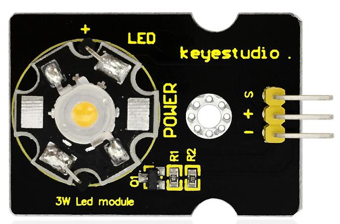

# Clignote et respire

# Aperçu

Dans ce projet, nous combinons les project [2](LedBlinkProject.md) et [3](BreathProject.md). Vous apprendrez comment controler la LED du module pour la faire clignoter deux fois, puis la faire respirer deux fois, de manière répétitive. Cette fois, nous utiliserons le module **LED 3W**, qui a une haute intensité et peut être utilisé comme illuminateur.

## Composants nécessaires

- carte micro:bit
- carte de connexion keyestudio micro:bit Sensor Shield v2
- cable USB
- module LED 3W
- 3 cable jumper Dupont

## Introduction aux composants

### Module LED 3W

Ce module LED a une très haute luminosité car la lampe qu'il inclut a une puissance de 3W. Vous pouvez utiliser ce module pour vos projets Arduino ou d'autres projets, idéal pour les robots et les applications de recherche et secours. Par exemple, les robots intelligents peuvent utiliser ce module à des fins d'illumination.
Notez que la lumière émise par ce module ne doit pas être dirigée vers des yeux humains pour des raisons de sécurité.

#### Specifications

- Température de couleur: 6000~7000K
- Flux lumineux: 180~210lm
- Courant: 700~750mA
- Puissance: 3W
- Angle d'illumination: 140 degree
- Température de fonctionnement: -50~80°C
- Température de stockage: -50~100°C
- Module LED haute puissance, contrôlé par port I/O de microcontroleur
- Type de port de contrôle: numérique
- Tension d'alimentation: 3.3~5V

## Cablage du circuit

Insérez la carte micro:bit dans le Sensor Shield.
Ensuite, connectez le module LED au Sensor Shield, connectez la pin S au port S0, la pin + au port V1 et la pin - au port GND.

## Code du programme

- on start
  - led enable *false*
- forever
  - repeat *2* times do
    - digital write pin *P0* to *1*
    - pause (ms) *1000*
    - digital write pin *P0* to *0*
    - pause (ms) *1000*
  - repeat *2* times do
    - while *val < 1024* do
      - set *val* = *val + 1*
      - analog write pin *P0* to *val*
      - pause (ms) *5*
    - while *val > 0* do
      - set *val* = *val - 1*
      - analog write pin *P0* to *val*
      - pause (ms) *5*

## Résultats

Une fois le cablage terminé et le circuit alimenté, envoyez le programme au micro:bit, vous devriez voir la LED du module clignoter deux fois, puis "respirer" deux fois, répétitivement.

