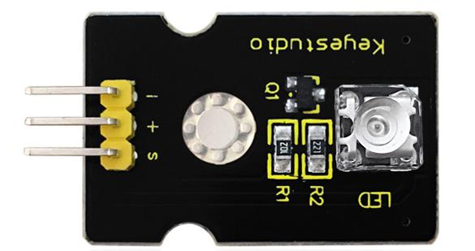

# Respire

## Aperçu

L'expérience "lumière respirante" est un petit peu similaire à l'[expérience précédente](LedBlinkProject.md). Cette fois, nous connectons le module keyestudio **LED blanche Piranha** au Sensor Shield. Connectez la pin Signal du module LED au port P0 du micro:bit. Dans le [diagramme de connexion du micro:bit](MicrobitPins.md), on note que le port P0 peut être utilisé comme entrée analogique (Analog In). Dans cette leçon, vous apprendrez comment contrôler la luminosité de la LED du module, la faisant devenir graduellement plus lumineuse puis plus sombre, comme si la LED respirait.

## Composants nécessaires

- carte micro:bit
- carte de connexion keyestudio micro:bit Sensor Shield v2
- cable USB
- module LED blanche Piranha
- 3 cable jumper Dupont

## Introduction aux composants

### Module LED blanche Piranha

Le module LED blanche Piranha a la même fonction que le module LED blanche simple. La différence réside dans l'apparence et la luminosité contrôlable de la LED sur le module.

## Cablage du circuit

Insérez la carte micro:bit dans le Sensor Shield.
Ensuite, connectez le module LED au Sensor Shield, connectez la pin S au port S0, la pin + au port V1 et la pin - au port GND.

## Code du programme

- on start
  - led enable *false*
- forever
  - while *val < 1024* do
    - set *val* = *val + 1*
    - analog write pin *P0* to *val*
    - pause (ms) *5*
  - while *val > 0* do
    - set *val* = *val - 1*
    - analog write pin *P0* to *val*
    - pause (ms) *5*

## Résultats

Une fois le cablage terminé et le circuit alimenté, envoyez le programme au micro:bit, vous devriez voir la LED du module graduellement devenir plus brillante puis graduellement devenir plus sombre, comme si la LED respirait.
