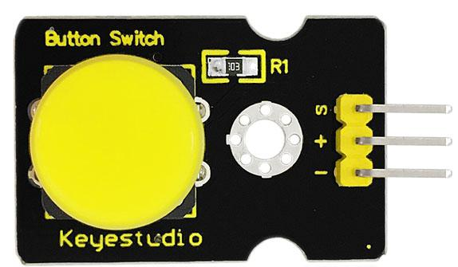
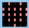

# Bouton de contrôl

## Aperçu

Lorsqu'on concoît un circuit, un interrupteur est un composant utilisé courament. La carte micro:bit est dotée de deux boutons poussoir. Cepenant, il est parfois nécessaire d'utiliser un bouton supplémentaire. Dans ce projet, nous apprendrons à utiliser notre module bouton poussoir pour contr$oler l'affichage de différentes images sur la matrice 5x5 de la carte micro:bit.

## Composants nécessaires

- carte micro:bit
- carte de connexion keyestudio micro:bit Sensor Shield v2
- cable USB
- module bouton poussoir
- 3 cables jumper Dupont

## Introduction aux composants

### Module bouton poussoir

Ce module est un module de base. Les boutons sont des composants électroniques utilisés courament pour contrôler des équipements. D'ordinaire, ils sont employés pour connecter ou déconnecter des circuits pour contrôler le fonctionnement d'autres périphériques. Ce module intègre un bouton poussoir avec 3 pins de connexion. Il est aussi très facile à utiliser avec d'autres circuits.

#### Caractéristiques
- Tension acceptée: entre 3.3V et 5V
- grand bouton avec un dessus jaune
- connexions de haute qualité
- étiquetage clair des connexions
- facile à connecter et à utiliser
- large trou de fixation pour pouvoir l'utiliser dans d'autres montages

#### Spécifications
- Tension d'alimentation: 3.3~5V
- Interface: Digital
- Dimensions: 30x20mm
- Poids: 4g

## Cablage du circuit
Insérez la carte micro:bit dans le Sensor Shield.
Ensuite connectez le module bouton poussoir au Sensor Shield, connectez la pin S au port S0, la pin + au port V1, la pin - au port GND comme illustré ci-après.

## Code du programme

- on start
  - clear screen
- forever
  - if _pin *P0* is pressed_ then
    - show icon 
  - else
    - show icon 

## Résultats
Une fois le cablage terminé et le circuit alimenté, envoyez le programme au micro:bit. Lorsque vous pressez le bouton du module, vous devriez voir  sur l'écran du micro:bit. Sinon, vous devriez voir
.
