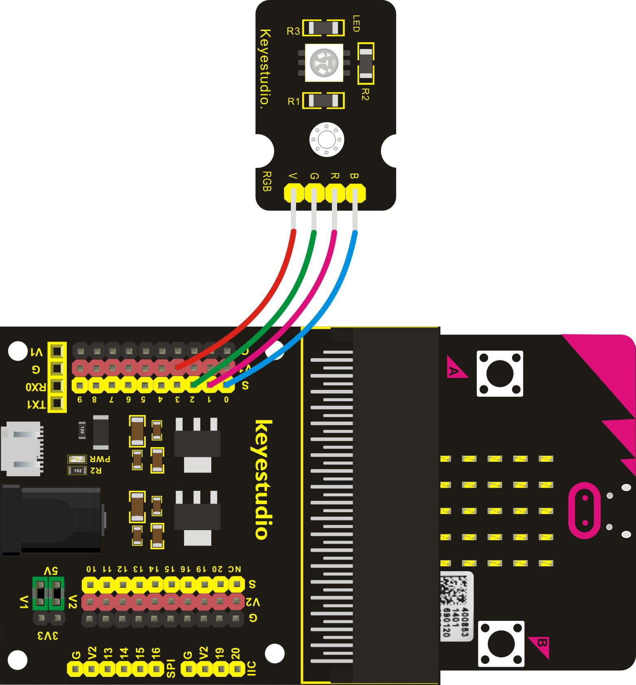
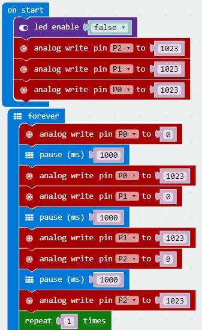
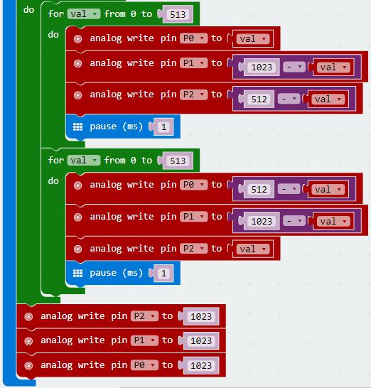
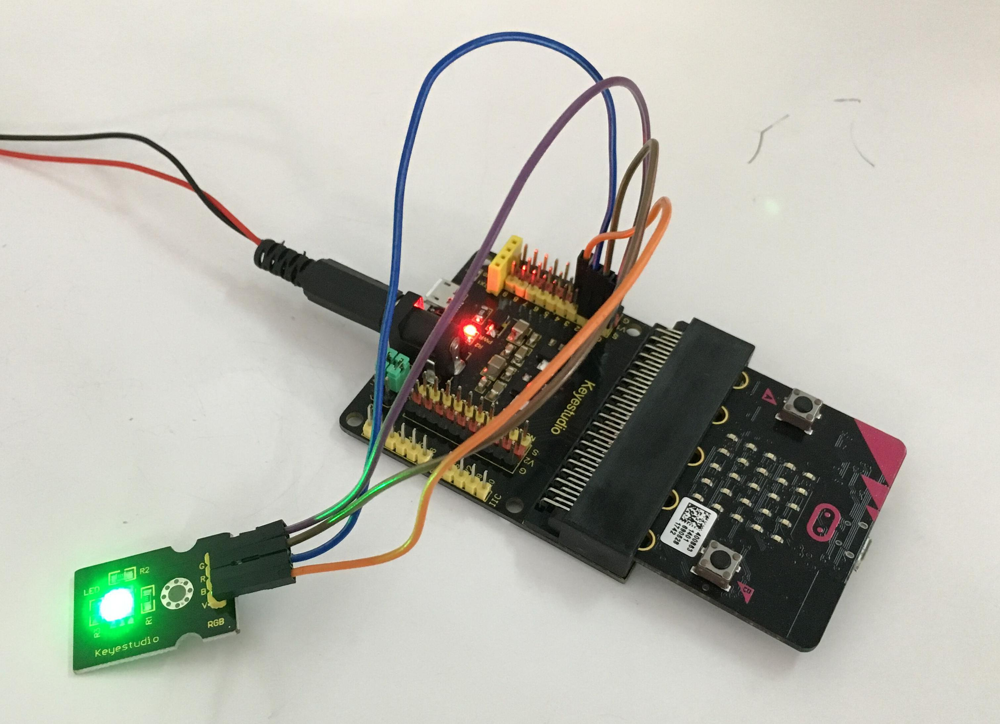
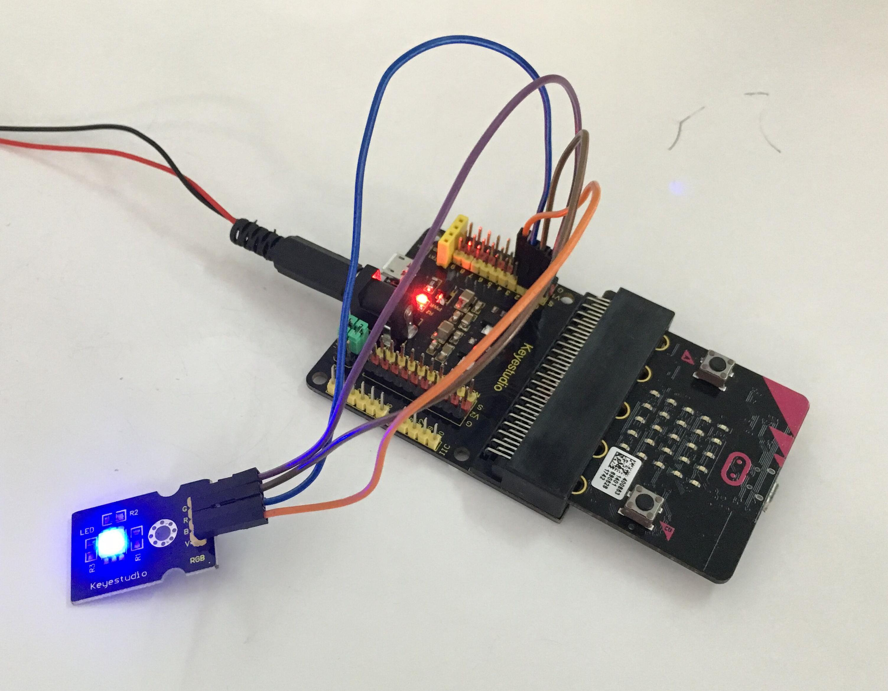

# Changement de couleur

## Aperçu

Dans ce projet, nous allons utiliser le module LED RGB. Ce module LED RGB à anode commune est une façon facile et amusante d'ajouter un peu de couleur à vos projets. Dans notre programme, nous allons connecter le module LED RGB à la carte micro:bit, puis en contrôler les sorties analogiques P0, P1, P2. Vous apprendrez comment contrôler la LED RGB du module tout d'abord pour afficher les 3 couleurs principales (rouge, vert et bleu). Ensuite, vous changerez rapidement la couleur.

## Composants nécessaires

- carte micro:bit
- carte de connexion keyestudio micro:bit Sensor Shield v2
- cable USB
- module LED RGB
- 4 cables jumper Dupont

## Introduction aux composants

### Module LED RGB

RGB vient des initiales (en anglais) des 3 couleurs primaires en synthèse additive: rouge (<b>R</b>ed), vert (<b>G</b>reen) et bleu (<b>B</b>blue). Les LEDs RGB sont comme 3 LEDs classiques en une, leur connexion et leur utilisation n'est pas très différente. Elles existent principalement en 2 versions: anode commune et cathode commune.  L'anode commune utilise le 5V comme pin commune tandis que la cathode commune utilise la masse.
La LED RGB du module utilise une LED à anode commune. Elle peut être vue comme 3 LEDs séparées. Les LEDs ont 3 diodes colorées différentes qui peuvent être combinées pour produire toute sorte de couleurs. Le module LED RGB est très facile à cabler, aved un trou de fixation permettant de l'installer sur tous vos appareils.

#### Spécifications

- Couleurs: rouge, vert et bleu
- Intensité lumineuse: haute
- Tension: 5V
- Entrée: niveau numérique

## Cablage du circuit
Insérez la carte micro:bit dans le Sensor Shield.
Ensuite, connectez le module LED RGB au Sensor Shield, connectez séparément les pins B, R et G aux ports P0, P1, P2, et la pin Ground au port GND.

## Code du programme

- on start
  - led enable *false*
  - analog write pin *P2* to *1023*
  - analog write pin *P1* to *1023*
  - analog write pin *P0* to *1023*
- forever
  - analog write pin *P0* to *0*
  - pause (ms) *1000*
  - analog write pin *P0* to *1023*
  - analog write pin *P1* to *0*
  - pause (ms) *1000*
  - analog write pin *P1* to *1023*
  - analog write pin *P2* to *0*
  - pause (ms) *1000*
  - analog write pin *P2* to *1023*
  - repeat *1* times do
    - for *val* from 0 to *513* do
      - analog write pin *P0* to *val*
      - analog write pin *P1* to *1023 - val*
      - analog write pin *P2* to *512 - val*
      - pause (ms) *1*
    - for *val* from 0 to *513* do
      - analog write pin *P0* to *512 - val*
      - analog write pin *P1* to *1023 - val*
      - analog write pin *P2* to *val*
      - pause (ms) *1*
    - analog write pin *P2* to *1023*
    - analog write pin *P1* to *1023*
    - analog write pin *P0* to *1023*

## Résultats
Une fois le cablage terminé et le circuit alimenté, envoyez le programme 1 au micro:bit, vous devriez voir le module RGB afficher les 3 couleurs séparément, rouge, vert, bleu. Ensuite, changer de couleur rapidement et de façon répétitive.

