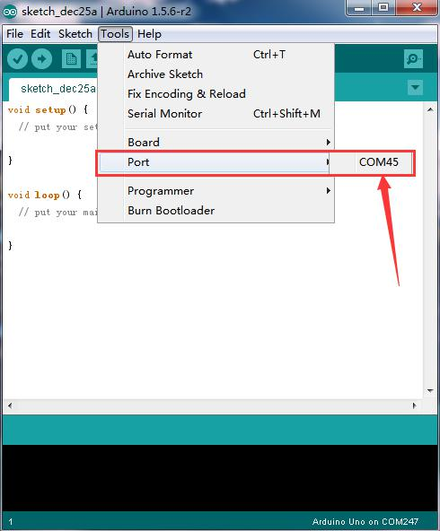
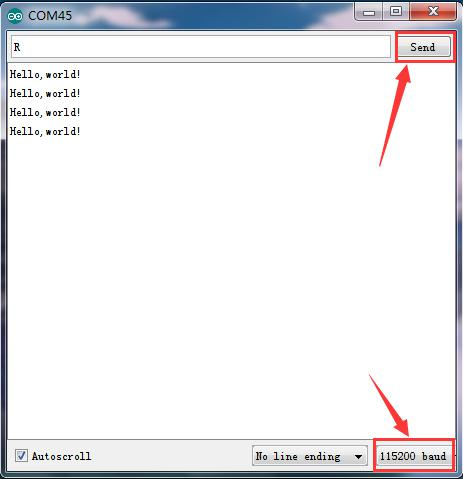

# Hello World

## Aperçu

Ce projet est très simple. Vous utiliserez uniquement la carte micro:bit et le cable USB cable pour afficher “Hello World!”. C'est une expérience de communication entre la carte micro:bit et le PC. Ceci est une expérienced d'introduction pour vous permettre d'entrer dans le monde de la programmation micro:bit.

Notez que ce projet nécessite l'utilisation du module de communication série, Arduino IDE. Les instructions d'installation d'Arduino IDE sont données dans [une autre page](InstallArduinoIde.md).

## Composants nécessaires

- carte micro:bit
- cable USB

## Cablage du circuit

Connectez la carte micro:bit à l'ordinateur par le cable micro USB.

## Code du programme

- on start
  - led enable *false*
- serial on data received *"R"*
  - serial write line *"Hello, World!"*
  - pause (ms) *500*

Après le codage, envoyez le programme (fichier .hex) à votre micro:bit, ensuite ouvrez Arduino IDE.

## Résultats

Ouvrez Arduino IDE, réglez correctement le port de communication.

Ensuite, ouvrez le moniteur du port série (Serial Monitor), sélectionnez le baud rate 115200 (car la communication USB-série du micro:bit est configurée à 115200 baud).

Entrez "R" et cliquez "Send", vous devriez voir "Hello, World!" s'afficher dans le moniteur comme montré ci-dessous.

Félicitations ! Le premier programme simple est terminé.
