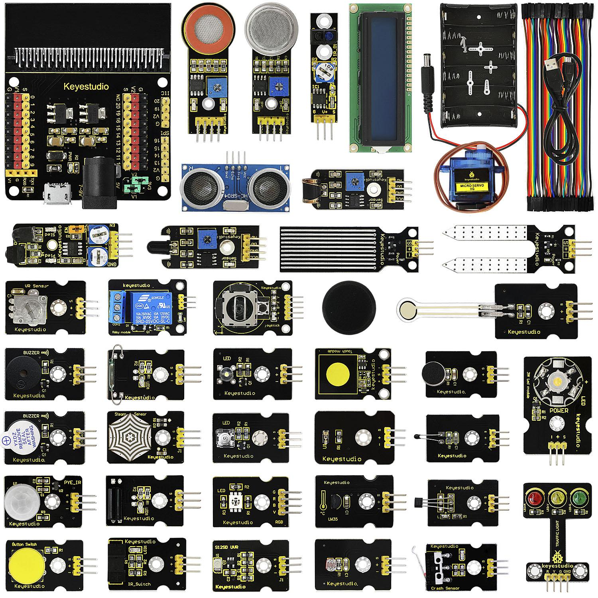

# Description du kit

Micro:bit est un puissant ordinateur portable, totalement programmable, conçu par la BBC. Il occupe seulement la place d'une demie carte de crédit, facilitant l'enseignement de la programmation aux enfants.

La carte intègre les fonctions Bluetooth, acceleromètre, boussole, 3 boutons, une matrice LED 5x5, interface USB et les bornes de connexion.

Afin de faciliter encore plus l'apprentissage de micro:bit, nous avons conçu ce kit en incluant le *keyestudio Sensor Shield* totalement compatible avec micro:bit et d'autres modules capteur d'usage courant.
De plus, ce kit de capteurs vous propose aussi différents projets d'apprentissage, incluant les schémas de cablage, le code source et d'autres informations.

Cela rendra votre apprentissage amusant et facile.

