#Kit List

|No.|Component|Quantity|Picture|
|---|---|---|---|
|1|Plaque de connexion keyestudio pour micro:bit|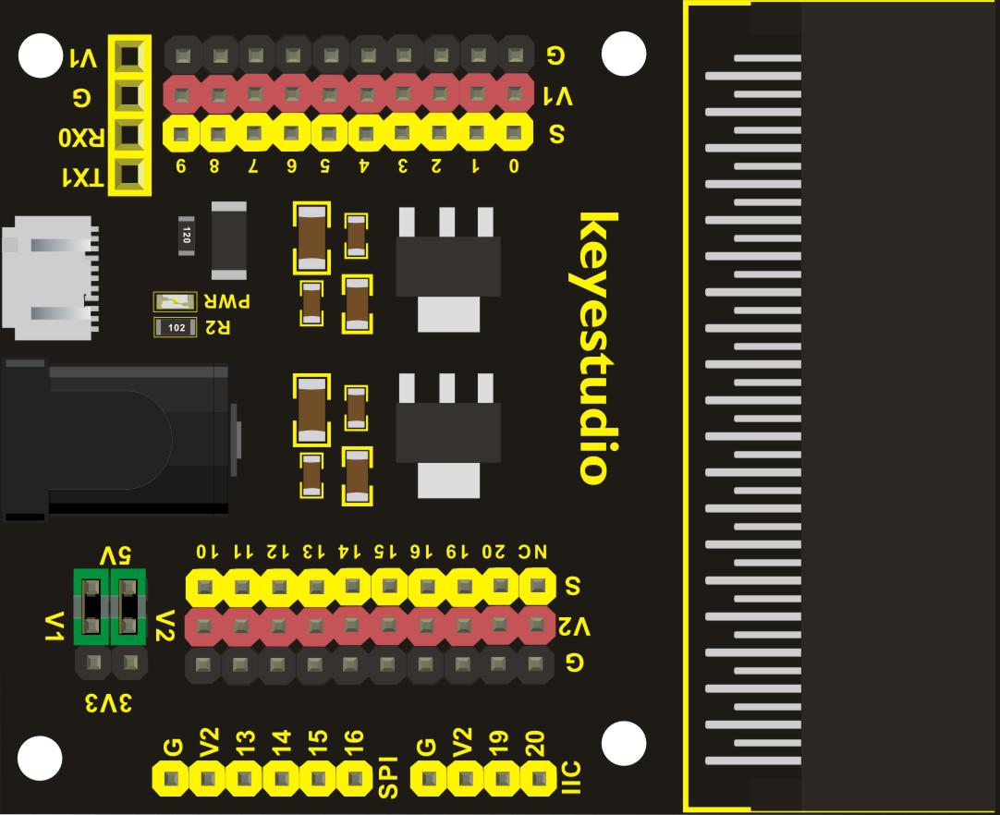|
|2|Module keyestudio digital LED blanche|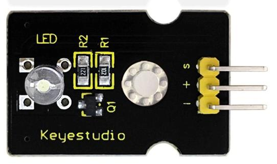|
|3|Module keyestudio LED blanche Piranha|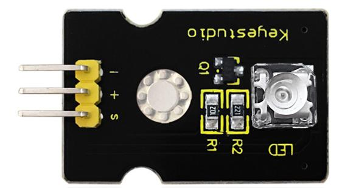|
|4|Module keyestudio LED 3W|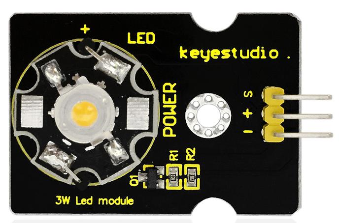|
|5|Module keyestudio LED RGB (couleur)||
|6|Module keyestudio capteur analogique de température|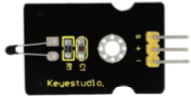|
|7|Module keyestudio cellule photosensible||
|8|Module keyestudio détecteur analogique de son|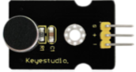|
|9|Module keyestudio capteur analogique de rotation|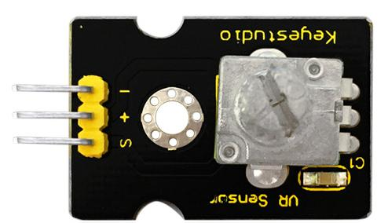|
|10|Module keyestudio buzzer passif|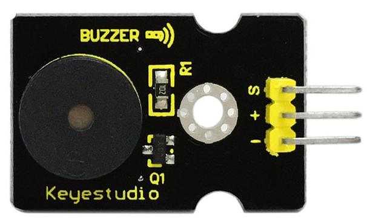|
|11|Module keyestudio buzzer numérique|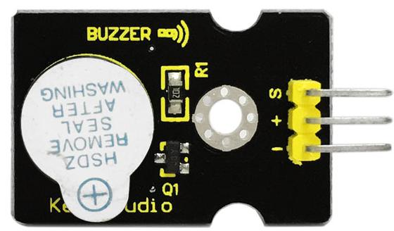|
|12|Module keyestudio bouton poussoir numérique|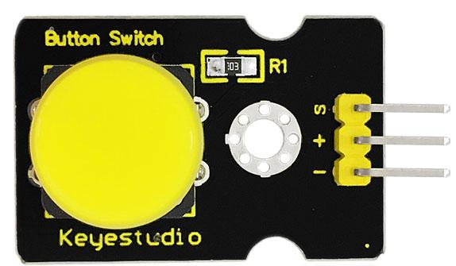|
|13|Module keyestudio capteur numérique d'inclinaison|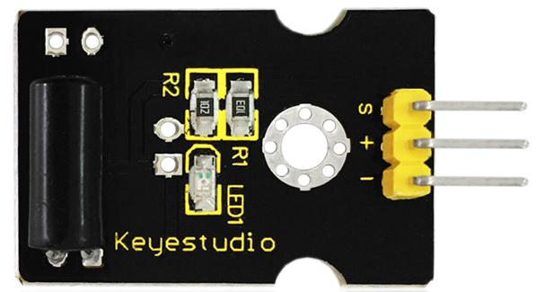|
|14|Module keyestudio interrupteur infrarouge|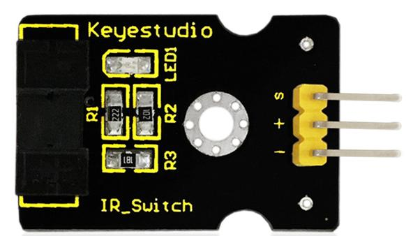|
|15|Module keyestudio capteur de toucher capacitif|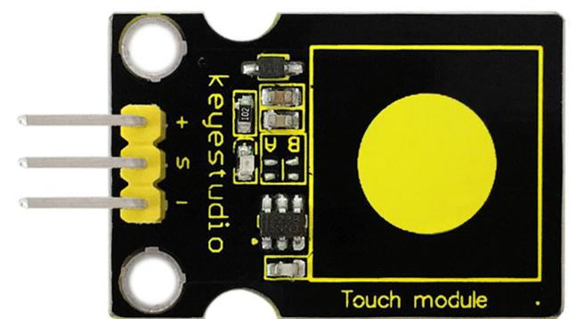|
|16|Module keyestudio feu tricolore|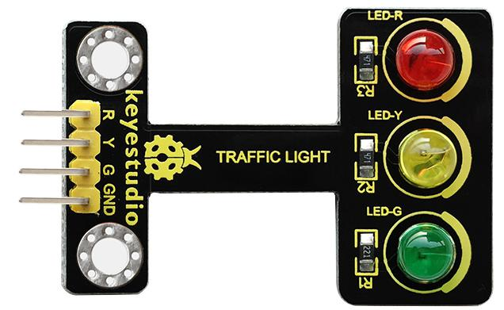|
|17|Module keyestudio capteur magnétique Hall||
|18|Module keyestudio capteur de suivi de ligne|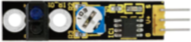|
|19|Module keyestudio détecteur d'obstacle par infrarouge|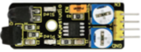|
|20|Module keyestudio détecteur de mouvement PIR|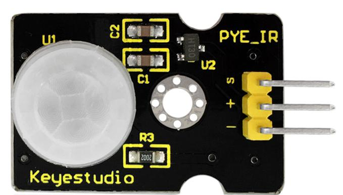|
|21|Module keyestudio détecteur de flame|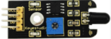|
|22|Module keyestudio détecteur de choc|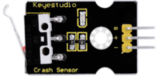|
|23|Module keyestudio détecteur analogique de gaz|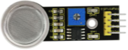|
|24|Module keyestudio capteur d'alcoolémie||
|25|Module keyestudio interrupteur Reed Switch|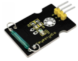|
|26|Module keyestudio capteur de niveau d'eau|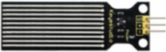|
|27|Module keyestudio capteur d'humidité du sol|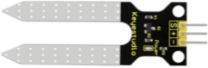|
|28|Module keyestudio capteur de température linéaire LM35|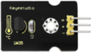|
|29|Module keyestudio capteur de vibration|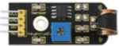|
|30|Module keyestudio capteur de pression à fine membrane|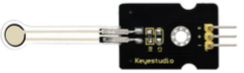|
|31|Module keyestudio capteur de lumière ultraviolette GUVA-S12SD 3528|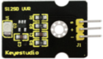|
|32|Module keyestudio afficheur I2C 16x2|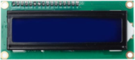|
|33|Module keyestudio capteur de lumière ambiante TEMT6000|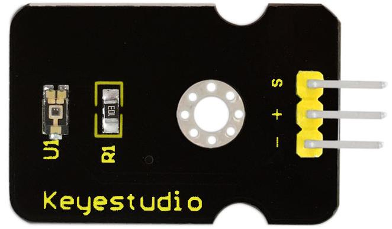|
|34|Module capteur à ultrasons HC-SR04|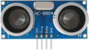|
|35|Module keyestudio joystick|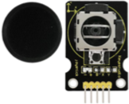|
|36|Module keyestudio micro servomoteur|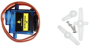|
|37|Module keyestudio relais simple|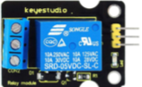|
|38|Module keyestudio capteur de vapeur|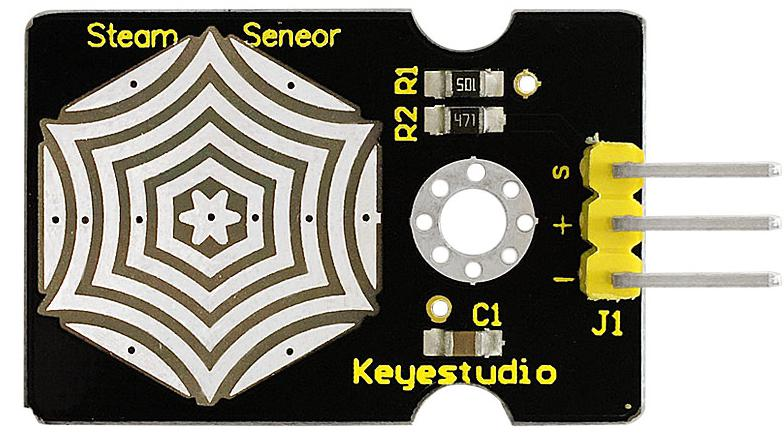|
|39|Cable 40pin jumper Dupont femelle-femelle|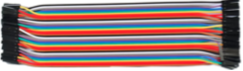|
|40|Cable USB|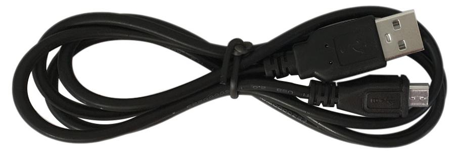|
|41|Boitier à piles (6 piles AA)|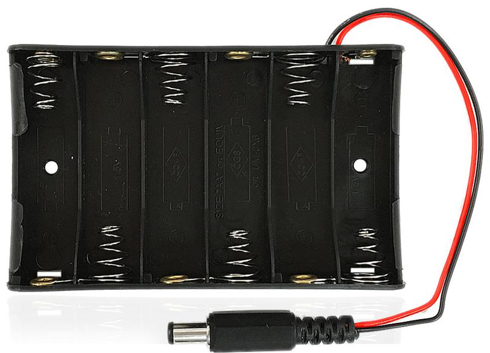|
