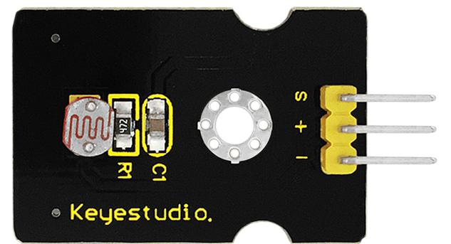
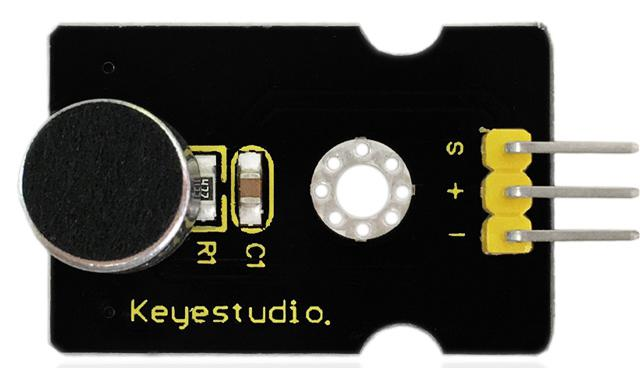
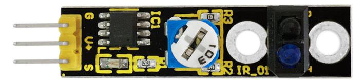
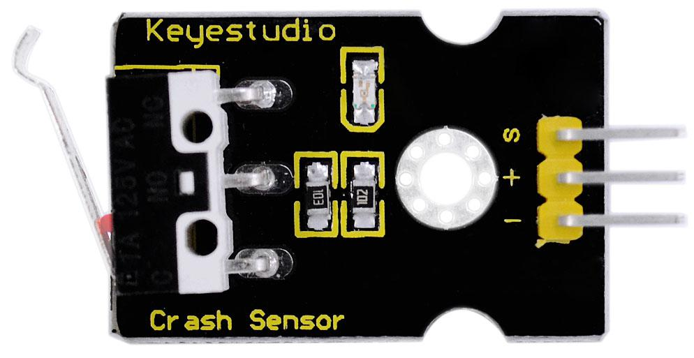
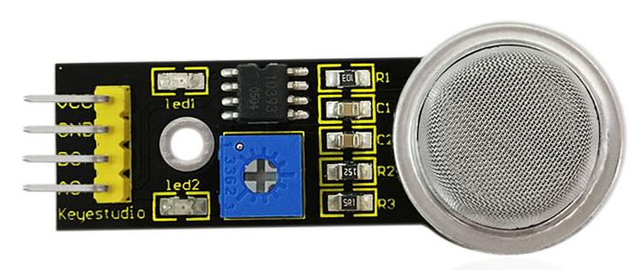
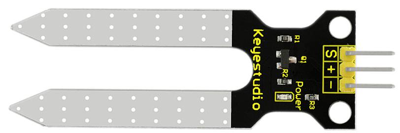
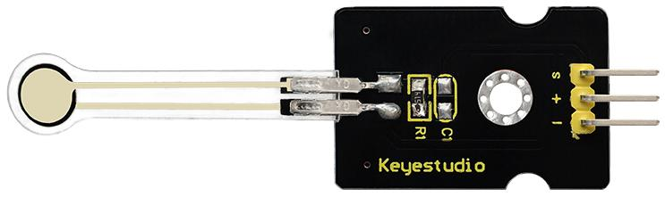
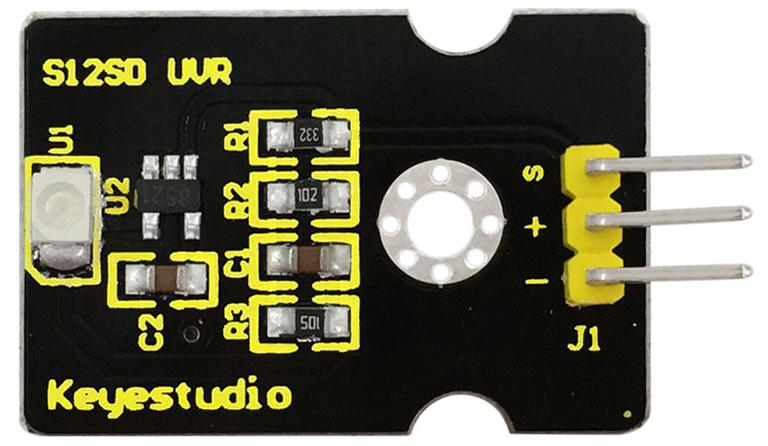
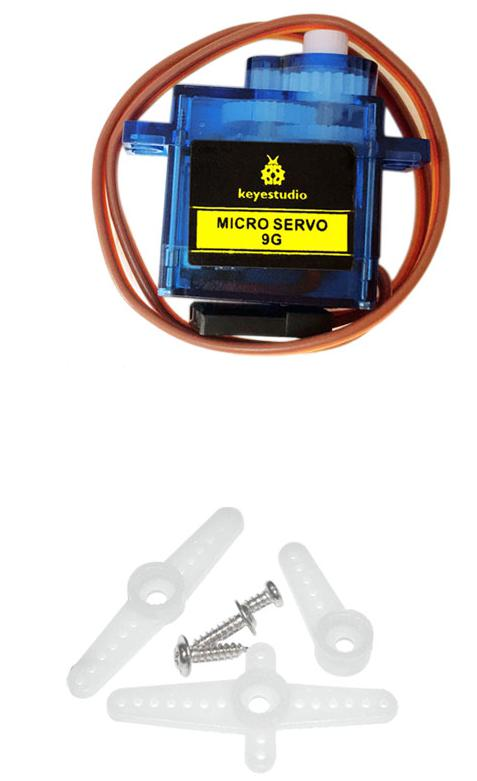
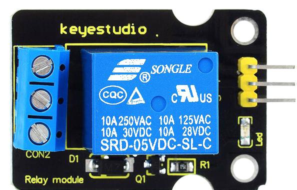

# Liste des composants du kit

|No.|Component|Image|Projets|
|---|---|---|---|
|1|Carte de connexion keyestudio Sensor Shield pour micro:bit||[Clignote](LedBlinkProject.md)|
|2|Module LED blanche simple||[Clignote](LedBlinkProject.md)|
|3|Module LED blanche Piranha||[Respire](BreathProject.md)|
|4|Module LED 3W||[Clignote & Respire](BlinkAndBreathProject.md)|
|5|Module LED RGB (couleur)||[Changement de couleur](ChangingColorProject.md)|
|6|Module capteur analogique de température||
|7|Module cellule photosensible||
|8|Module détecteur analogique de son||
|9|Module capteur analogique de rotation||
|10|Module buzzer passif||[Joue de la musique](PlayMusicProject.md)|
|11|Module buzzer numérique actif||[Produire un son](MakeASoundProject.md)|
|12|Module bouton poussoir numérique||[Bouton de contrôle](ButtonControlProject.md)|
|13|Module capteur numérique d'inclinaison||[Contrôle par inclinaison](TiltControlProject.md)|
|14|Module interrupteur infrarouge||
|15|Module capteur de toucher capacitif||
|16|Module feu tricolore||
|17|Module capteur magnétique Hall||
|18|Module capteur de suivi de ligne||
|19|Module détecteur d'obstacle par infrarouge||
|20|Module détecteur de mouvement PIR||
|21|Module détecteur de flame||
|22|Module détecteur de choc||
|23|Module détecteur analogique de gaz||
|24|Module capteur d'alcoolémie||
|25|Module interrupteur Reed Switch||
|26|Module capteur de niveau d'eau||
|27|Module capteur d'humidité du sol||
|28|Module capteur de température linéaire LM35||
|29|Module capteur de vibration||
|30|Module capteur de pression à fine membrane||
|31|Module capteur de lumière ultraviolette GUVA-S12SD 3528||
|32|Module afficheur I2C 16x2||
|33|Module capteur de lumière ambiante TEMT6000||
|34|Module capteur à ultrasons HC-SR04||
|35|Module joystick||
|36|Module micro servomoteur||
|37|Module relais simple||
|38|Module capteur de vapeur||
|39|Cable 40pin jumper Dupont femelle-femelle||
|40|Cable USB||
|41|Boitier à piles (6 piles AA)||
