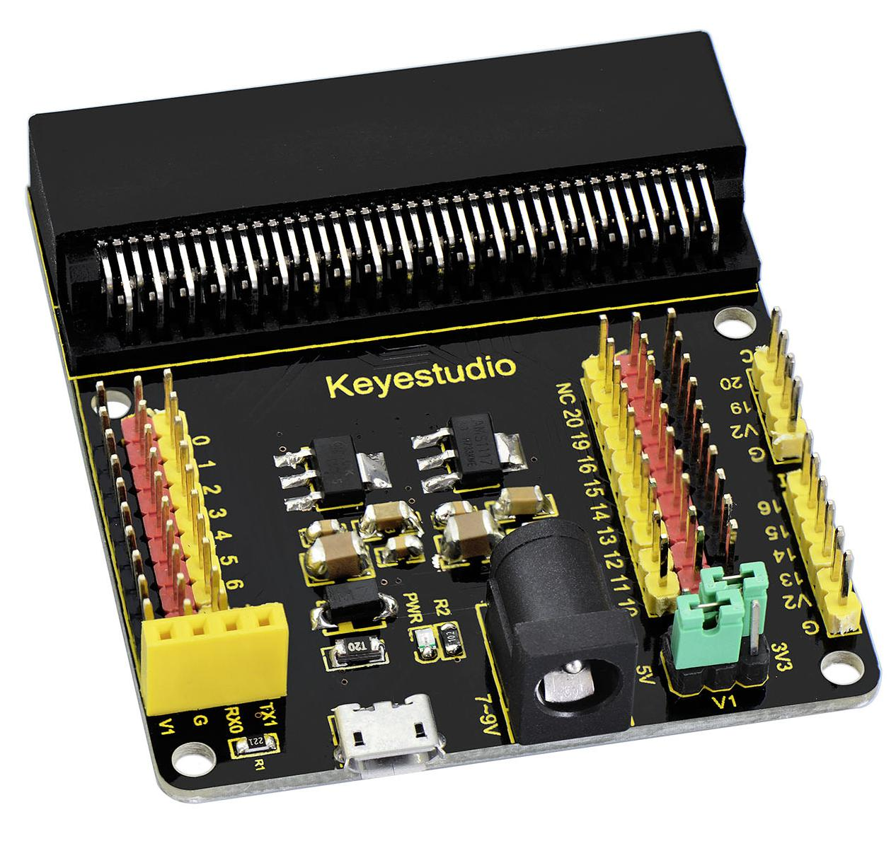
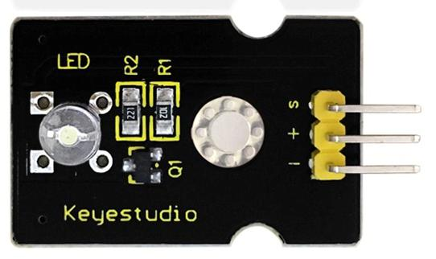
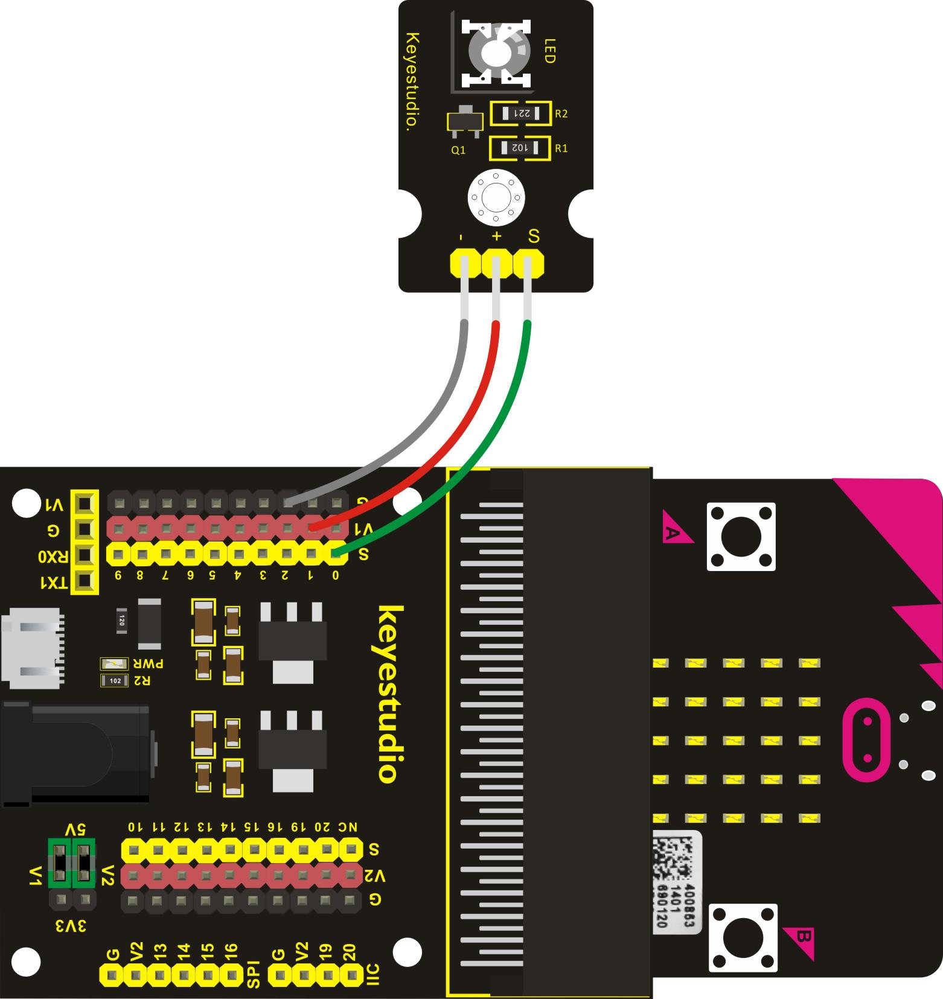
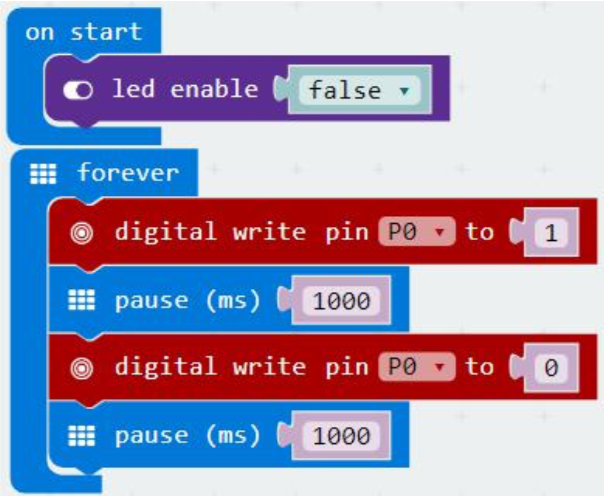

# LED clignotante

## Aperçu

Le clignotement de LED est une des expériences les plus basiques. Dans l'exemple d'utilisation du micro:bit ci-dessous, nous avons mentionné l'affichage à 25 LED du micro:bit. Dans ce projet, vous allez apprendre à contrôler le clignotement d'une LED en utilisant un module LED blanche keyestudio et la carte sensor shield. Avant de tester, nous devons d'abord désactiver l'affichage 5x5 du micro:bit.

## Composants nécessaires

- carte micro:bit
- carte de connexion keyestudio micro:bit Sensor Shield v2
- cable USB
- module keyestudio LED blanche
- 3 cables jumper Dupont

## Introduction aux composants

### Carte de connexion keyestudio micro:bit Sensor Shield v2

Cette carte permet un raccordement très facile du micro:bit. Elle sépare les ports PI0 sous la forme de 3 pins (GND, VCC, PI0), facilitant la connexion d'autres modules. Elle sépare aussi les interfaces de communications comme le port série, I2C et SPI. Vous pouvez alimenter la carte par le port USB ou par une alimentation externe 7-9V DC. Si un module nécessite une alimentation, vous pouvez la lui fournir au moyen des port V1 et V2, qui fournisse respectivement 3.3V et 5V DC.

Alimentez la carte avec une alimentation 7-9V DC et cette carte pourra alimenter la carte micro:bit ainsi que les autres modules.

### Module keyestudio LED blanche

Ce module LED blanche est idéal pour les débutants avec Arduino (?). Il peut être aisément connecté au Sensor Shield. Il permet quelques interactions lumineuses.

#### Spécifications
- Type: Digital
- PH2.54 socket
- Taille: 30*20mm
- Poids: 3g

## Cablage du circuit

Insérez le micro:bit dans le keyestudio micro:bit sensor shield. Ensuite, connectez le module LED au micro:bit sensor shield, connectez la S pin au port S, la pin + au port V1 et la pin - au port GND.

## Code du programme

- on start
  - led enable *false*
- forever
  - digital write pin *P0* to *1*
  - pause (ms) *1000*
  - digital write pin *P0* to *0*
  - pause (ms) *1000*

## Résultats

Une fois le cablage terminé et le circuit alimenté, envoyez le programme au micro:bit, vous verrez la LED clignoter sur le module, avec un intervalle d'environ 1 seconde.
