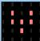

# Interrupteur lumineux

## Aperçu

Dans la vie quotidienne, nous avons souvent besoin d'implémenter une fonction de comptage et de mesure de vitesse. Comment réaliser ces fonctions? *You can easily
match photo-interrupter module with microcontroller via code debugging. ???*
Dans cette leçon, nous connectons le module interrupteur lumineux avec le Sensor Shield, pour contrôler l'affichage de différentes images sur la matrice 5x5 de la carte micro:bit.

## Composants nécessaires

- carte micro:bit
- carte de connexion keyestudio micro:bit Sensor Shield v2
- cable USB
- module interrupteur lumineux
- 3 cables jumper Dupont

## Introduction aux composants

### Module interrupteur lumineux

Un interrupteur lumineux est un capteur qui combine face à face, un élément émetteur de lumière et un élément récepteur de lumière. Il fonctionne suivant le principe que la lumière est interrompue lorsqu'un objet passe à travers de capteur.
C'est pour cette raison que les interrupteurs lumineux sont très utilisés dans des applications variées comme la mesure de vitesse, le positionnement, le comptage, les petites appareils domestiques, les détecteurs optiques de franchissement de limites, la détection d'objet, etc.
Pendant le test, si un objet est inséré dans la fente du capteur, la pin Signal du module va continuellement apparaître comme variant entre niveau haut et bas. On peut alors évaluer le mouvement de l'objet en observant les variations du signal. En implémentant une fonction de comptage, on pourra calculer sa vitesse.

#### Caractéristiques
- Temps de réponse rapide; haute sensibilité
- avec interface pour la production de lumière et l'interface à 3 pins
- Tension d'alimentation: 3.3~5V
- Interface: Digital
- Dimensions: 30x20mm

## Cablage du circuit
Insérez la carte micro:bit dans le Sensor Shield.
Ensuite connectez le module interrupteur lumineux au Sensor Shield, connectez la pin S au port S0, la pin + au port V1, la pin - au port GND comme illustré ci-après.

## Code du programme

- on start
  - clear screen
- forever
  - if _digital read pin *P0*_ = *1* then
    - show icon 
  - else
    - show icon 

Note: vous pouvez changer les images si vous le souhaitez.

## Résultats
Une fois le cablage terminé et le circuit alimenté, envoyez le programme au micro:bit. Lorsqu'une feuille de papier est insérée dans la fente du capteur, vous devriez voir  sur l'écran du micro:bit. Sinon, vous devriez voir
.
