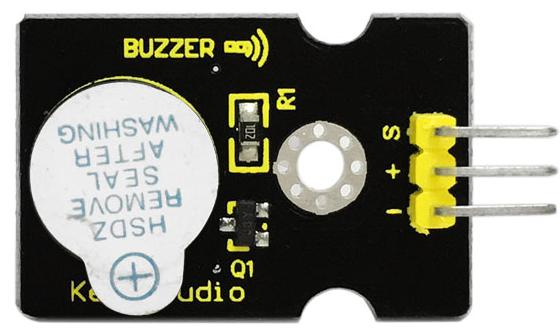
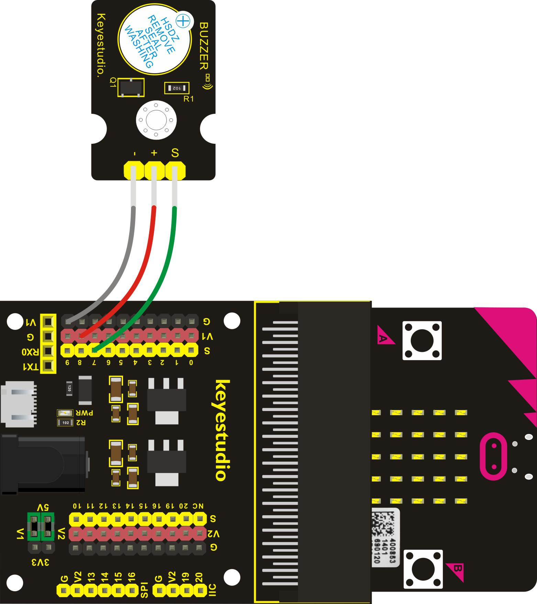

# Produire un son

# Aperçu

Dans ce projet, vous apprendrez comment générer un son avec le module **buzzer numérique actif**. De façon similaire au projet [LED clignotante](LedBlinkProject.md), dans cette leçon, le buzzer est activé et désactiver de façon répétée.

## Composants nécessaires

- carte micro:bit
- carte de connexion keyestudio micro:bit Sensor Shield v2
- cable USB
- module buzzer numérique actif
- 3 cable jumper Dupont

## Introduction aux composants

### Module buzzer numérique actif

C'est le module de production de sons le plus simple. Vous pouvez utiliser des niveaux haut et bas pour le piloter. Changer la fréquence de commutation peut produire des sons différents. Les buzzers peuvent être divisés en 2 catégories: les actifs et les passifs. La différence entre les deux est qu'un buzzer actif à un oscillateur intégrer, il produit un son quand il est alimenté. Le buzzer de ce module est un buzzer actif.
Ce module est largement utilisé dans des applications courantes comme les PC, les réfrigérateurs, les téléphones, les minuteries and d'autres équipements électroniques.

#### Spécifications

- Tension de fonctionnement: 3.3-5V
- Type d'interface: digital
- Dimension: 30*20mm
- Poids: 4g

## Cablage du circuit

Insérez la carte micro:bit dans le Sensor Shield.
Ensuite, connectez le module buzzer au Sensor Shield, connectez la pin S au port S7 (pin P7 de la carte micro:bit), la pin + au port V1, la pin - au port GND.
Si un niveau haut est fourni via le port P7, le buzzer continue à sonner.

## Code du programme

- on start
  - led enable *false*
- forever
  - digital write pin *P7* to *1*
  - pause (ms) *1000*
  - digital write pin *P7* to *0*
  - pause (ms) *1000*

## Résultats

Une fois le cablage terminé et le circuit alimenté, envoyez le programme au micro:bit, vous devriez entendre le son du module buzzer par intermitence. Il semble que le son est interrompu.
