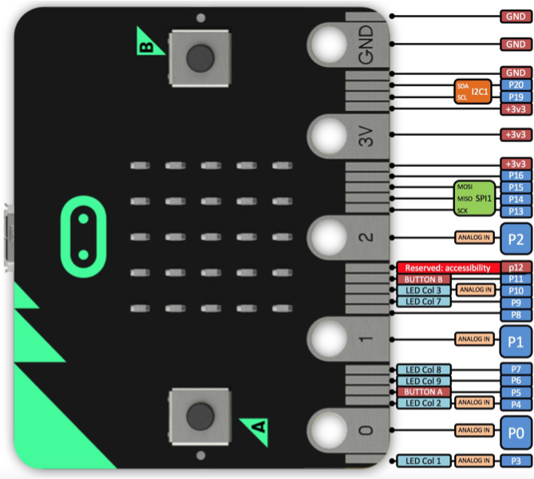
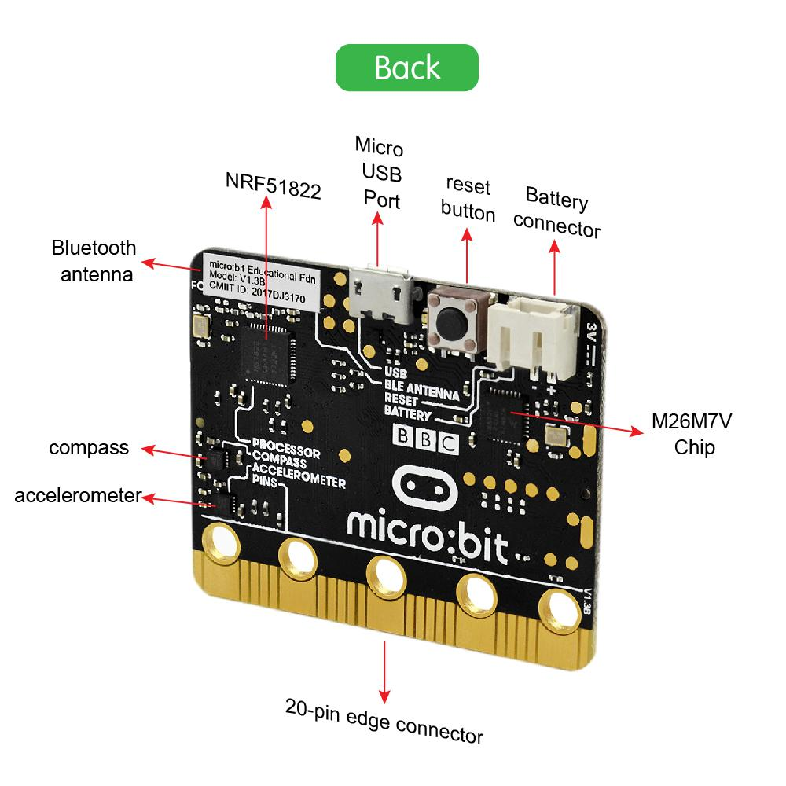

# Connexions de la carte micro:bit

Avant de commencer avec les projets suivant, nous devons d'abord déterminer la/les fonctions de chacune des connexions de la carte micro:bit. Référez vous au diagramme suivant:

La carte BBC micro:bit a 25 connexions externes sur le côté connecteur de la carte, que nous appelerons 'pins'. Le côté connecteur est la partie grise à droite dans le dessin ci-dessus. Il y a 5 grandes pins, qui sont aussi connectées aux trous étiquetés : 0, 1, 2, 3V, and GND (masse). Sur le même côté de la carte, il y a aussi 20 petites pins que vous pouvez utiliser lorsque vous connecter le BBC micro:bit dans un connecteur (comme, par exemple, le keyestudio Sensor Shield).

Notez que ces informations viennent du site web officiel BBC micro:bit. Pour de plus amples informations, visitez les pages suivantes:
- BBC micro bit Pins: http://microbit.org/guide/hardware/pins/
- BBC micro:bit website: http://microbit.org/
- Micro bit MakeCode Block Editor: https://makecode.microbit.org/
- Meet micro:bit starter programming: http://microbit.org/guide/
- BBC micro:bit Features Guide: http://microbit.org/guide/features/
- BBC micro:bit Safety Warnings: http://microbit.org/guide/features/
- BBC micro:bit Quick Start Guide: http://microbit.org/guide/quick/

## Vue de face

- 5*5 LED display: matrice LED 5x5
- programmable button A/B: bouton programmable A/B
- 3 digital/analog I/O rings: 3 entrées/sorties numériques/analogiques
- power port 3V: port d'alimentation (+3V)
- power port GND: port d'alimentation (masse)

## Vue de dos

- Bluetooth antenna: antenne Bluetooth
- micro USB port: port micro USB
- reset button: bouton de redémarrage
- battery connector: connecteur de batterie
- compass: boussole
- accelerometer: acceléromètre
- 20-pin edge connector: bord de connecteurs à 20pins

Après avoir donné les informations de base à propos du BBC micro:bit, dans les sections suivantes, passons aux projets de programmation. Utilisez cette petite carte avec le Sensor Shield et les autres modules capteurs pour faire des expériences interactives. Jouez avec, apprenez avec. Passez de moments merveilleux !
