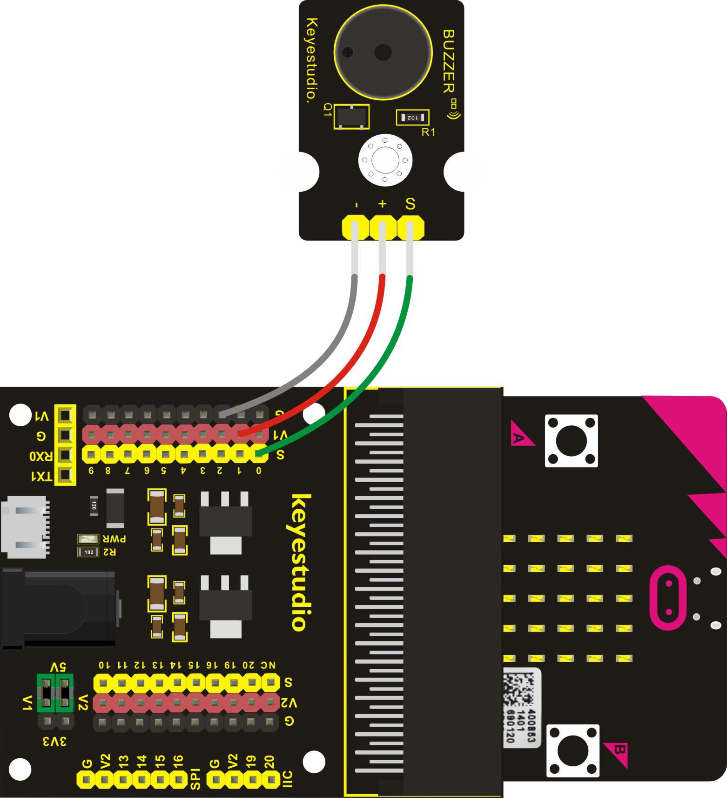
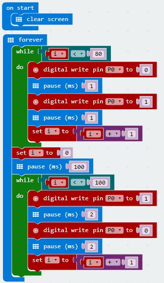
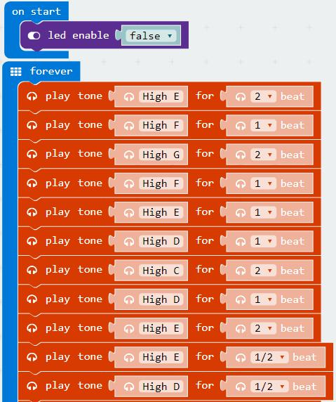
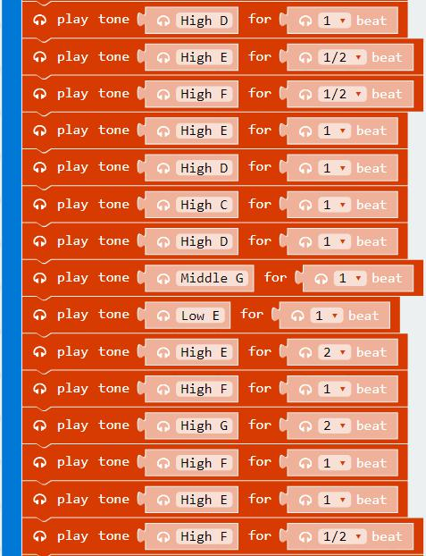
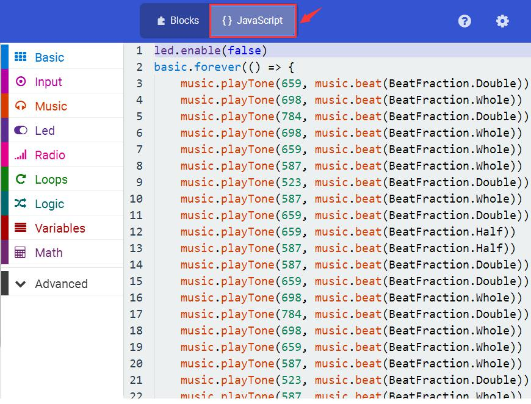

# Joue de la musique

## Aperçu

Dans ce projet, vous allez apprendre à jouer de la musique avec le module **buzzer passif**. Nous allons procéder à deux expériences.
La première contrôle directement les niveaux haut et bas du port P0 du micro:bit, en produisant deux ondes carrées pour contrôler le son du buzzer.
L'autre utilise une fonction intégrée du logiciel, en produisant des ondes carrées de différentes longueurs et de différentes fréquencesvia le port P0. Enfin, nous ferons jouer l'["Hymne à la joie"](http://pianoletternote.com/beethoven-ode-to-joy-piano-letter-note/).
(Seul le port d'entrée/sortie P0 peut être utiliser pour cette fonction, aucun autre port.)

## Composants nécessaires

- carte micro:bit
- carte de connexion keyestudio micro:bit Sensor Shield v2
- cable USB
- module buzzer passif
- 3 cable jumper Dupont

## Introduction aux composants

### Module buzzer passif

Les buzzers peuvent être divisés en 2 catégories: les actifs et les passifs. La différence entre les deux est qu'un buzzer actif à un oscillateur intégré, il produit un son quand il est alimenté. Le buzzer utilisé avec ce module est un buzzer passif. Un buzzer passif n'a pas d'oscillateur intégré, de sorte qu'un courant continu ne peut pas être utilisé pour produire un bip. A la place, il faut utiliser une onde carrée dont la fréquence doit être comprise entre 2kHz et 5kHz pour le piloter. Différentes fréquences produisent des sons  différents. Vous pouvez utiliser micro:bit pour coder la mélodie d'une chanson, simple et amusant.

#### Spécifications
- Tension de fonctionnement: 3.3-5V
- Type d'interface: digital

## Cablage du circuit
Insérez la carte micro:bit dans le Sensor Shield.
Ensuite, connectez le module buzzer passif au Sensor Shield, connectez la pin S pin au port S0, la pin + au port V1, la pin - au port GND.

## Code du programme

### Programme 1

- on start
  - clear screen
- forever
  - while *i < 80* do
    - digital write pin *P0* to *0*
    - pause (ms) *1*
    - digital write pin *P0* to *1*
    - pause (ms) *1*
    - set *i* to *i + 1*
  - set *i* to *0*
  - pause (ms) *100*
  - while *i < 100* do
    - digital write pin *P0* to *0*
    - pause (ms) *2*
    - digital write pin *P0* to *1*
    - pause (ms) *2*
    - set *i* to *i + 1*

### Programme 2

- on start
  - led enable *false*
- forever
  - play tone *High E* for *2* beat
  - play tone *High F* for *1* beat
  - play tone *High G* for *2* beat
  - play tone *High F* for *1* beat
  - play tone *High E* for *1* beat
  - play tone *High D* for *1* beat
  - play tone *High C* for *2* beat
  - play tone *High D* for *1* beat
  - play tone *High E* for *2* beat
  - play tone *High E* for *1/2* beat
  - play tone *High D* for *1/2* beat
  - play tone *High D* for *2* beat
  - play tone *High E* for *2* beat
  - play tone *High F* for *1* beat
  - play tone *High G* for *2* beat
  - play tone *High F* for *1* beat
  - play tone *High E* for *1* beat
  - play tone *High D* for *1* beat
  - play tone *High C* for *2* beat
  - play tone *High D* for *1* beat
  - play tone *High E* for *1* beat
  - play tone *High D* for *1* beat
  - play tone *High D* for *1/2* beat
  - play tone *High C* for *1/2* beat
  - play tone *High C* for *2* beat
  - play tone *High D* for *2* beat
  - play tone *High E* for *1* beat
  - play tone *High C* for *1* beat
  - play tone *High D* for *1* beat
  - play tone *High E* for *1/2* beat
  - play tone *High F* for *1/2* beat
  - play tone *High E* for *1* beat

  - play tone *High D* for *1* beat
  - play tone *High E* for *1/2* beat
  - play tone *High F* for *1/2* beat
  - play tone *High E* for *1* beat
  - play tone *High D* for *1* beat
  - play tone *High C* for *1* beat
  - play tone *High D* for *1* beat
  - play tone *Middle G* for *1* beat
  - play tone *Low E* for *1* beat
  - play tone *High E* for *2* beat
  - play tone *High F* for *1* beat
  - play tone *High G* for *2* beat
  - play tone *High F* for *1* beat
  - play tone *High E* for *1* beat
  - play tone *High F* for *1/2* beat
  - play tone *High D* for *1/2* beat
  - play tone *High C* for *2* beat
  - play tone *High D* for *1* beat
  - play tone *High E* for *1* beat
  - play tone *High D* for *1* beat
  - play tone *High D* for *1/2* beat
  - play tone *High C* for *1/2* beat
  - play tone *High C* for *2* beat

Note: sur la page web MakeCode Block, si vous cliquez sur l'icône **\{\} Javascript**, vous verrez les fréquences de chaque tonalité comme suit:

## Résultats

Une fois le cablage terminé et le circuit alimenté, envoyez le programme 1 au micro:bit, vous devriez entendre deux sons produit par le buzzer.
Si vous envoyez le programme 2 au micro:bit, le buzzer jouera l'"Hymne à la joie" ! Surprenant!
OK? Vous pouvez changer les notes pour jouer d'autres musiques.
