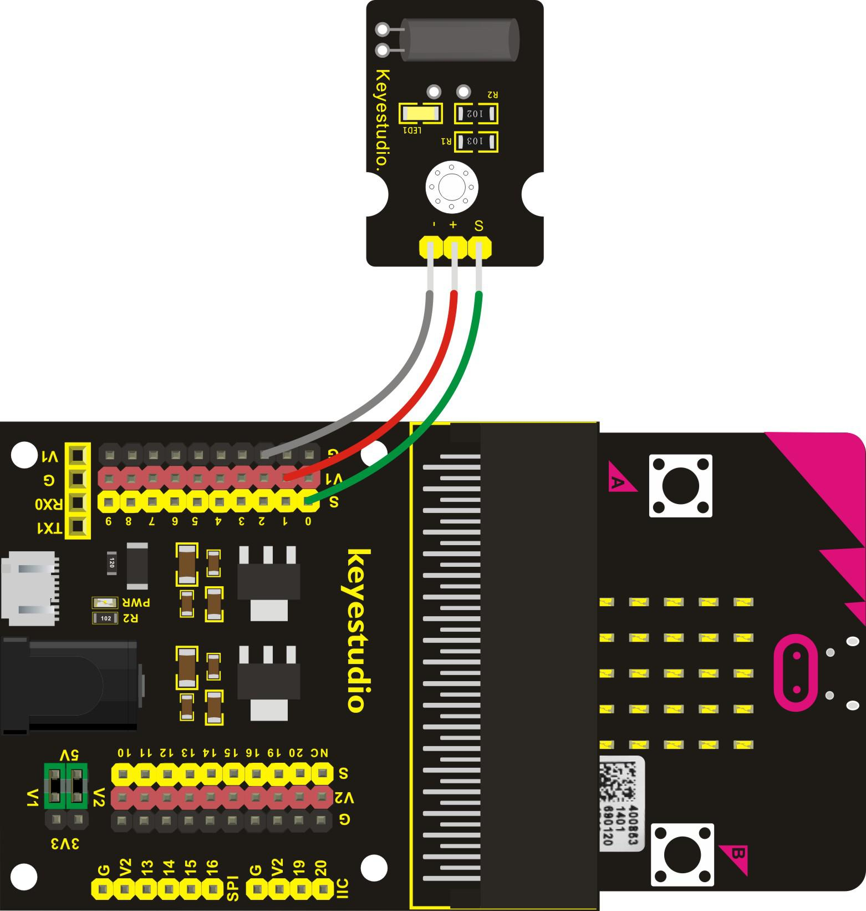
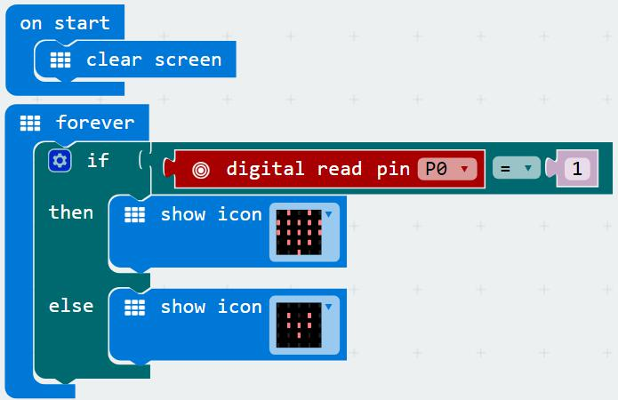
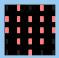
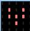

# Bouton de contrôl

## Aperçu

Lors de la conception d'un circuit, il est parfois nécessaire de déterminer si un objet est incliné à gauche ou à droite. Dans ce cas, il convient d'utiliser un capteur d'inclinaison. Dans ce projet, vous apprendrez à utiliser un capteur numérique d'inclinaison pour contrôler l'image affichée par la matrice 5x5 de la carte micro:bit.

## Composants nécessaires

- carte micro:bit
- carte de connexion keyestudio micro:bit Sensor Shield v2
- cable USB
- module capteur numérique d'inclinaison
- 3 cables jumper Dupont

## Introduction aux composants

### Module capteur numérique d'inclinaison

Le module capteur numérique d'inclinaison intègre essentiellement un capteur d'inclinaison. Un tel capteur est un composant qui détecte l'inclinaison d'un objet.
Le principle est très simple. Il utilise utilise une bille dans un interrupteur qui réagit à différents angles d'inclinaison pour déclencher des circuits. Lorsque la bille dans l'interrupteur d'inclinaison passe d'une connexion à une autre par la force d'une secousse extérieure, le capteur d'inclinaison sera ou non conducteur.

#### Spécifications
- Tension d'alimentation: 3.3~5V
- Interface: Digital
- Dimensions: 30x20mm
- Poids: 3g

## Cablage du circuit
Insérez la carte micro:bit dans le Sensor Shield.
Ensuite connectez le module capteur numérique d'inclinaison au Sensor Shield, connectez la pin S au port S0, la pin + au port V1, la pin - au port GND comme illustré ci-après.

## Code du programme

- on start
  - clear screen
- forever
  - if _digital read pin *P0*_ = *1* then
    - show icon 
  - else
    - show icon 

Note: vous pouvez changer les images si vous le souhaitez.

## Résultats
Une fois le cablage terminé et le circuit alimenté, envoyez le programme au micro:bit. Lorsque vous inclinez le module à gauche, vous devriez voir  sur l'écran du micro:bit. Lorsqu'il est incliné vers la droite, vous devriez voir
.
